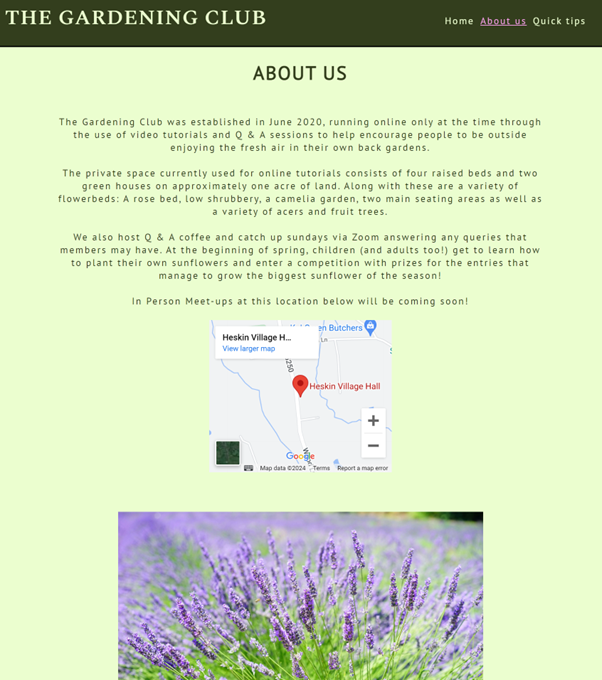
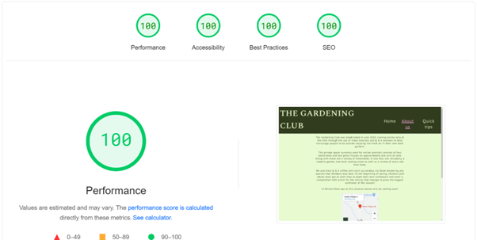

# THE GARDENING CLUB

This is the static website of The Gardening Club's website. It is a website that encourages people to want to join the Gardening Club no matter their ability. The website is designed to be fully functional and responsive across various devices.

The live link can be found here - https://beebeebethc.github.io/The-Gardening-Club/

- - -

## Contents

* [Target Audience](#target-audience-and-user-experience)
   * [Target Audiences](#target-audience)
* [User Experience](#user-stories)
   * [New Gardeners](#someone-who-has-never-done-any-gardening)
   * [Accessibility at the fore-front](#accessibility-for-all-first)
   * [User friendly](#user-friendly-across-multiple-devices)

* [Design and Accessibility](#design-and-accessibility)
   * [Colour palette](#colour-choices-for-this-website)
   * [Typography](#typography)

* [Features](#features)
   * [Desktop Wire-frames](#wireframes-for-desktop-devices)
   * [Tablet Wire-frames](#wireframes-for-mobile---tablet-devices)
   * [Mobile Wire-frames](#wireframes-for-mobile-devices)
   * [Landing page](#landing-page-for-the-website)

* [Accessibility](#accessibility-in-more-depth)
   * [Screen-Readers](#screen-readers)
   * [Font Choices](#font-choices)
   * [Colour-Blindness](#colour-blindness)
   * [Future Implementations](#future-implementations)

* [Languages, Technologies, Frameworks and Libraries](#technologies-used)
   * [Languages](#languages)
   * [Technologies, Frameworks and Libraries Used](#technologies-frameworks-and-libraries-used)
   * [Other Programmes Used](#other-programmes-used)

* [Full Website Testing](#full-website-testing)

* [Further Testing](#further-testing)
   * [Wave Testing](#wave-testing)
   * [Form Validator Testing](#validator-testing)
   * [Jigsaw CSS Testing](#css)
   * [W3S HTML Testing](#html-pages)
   * [Lighthouse Scoring](#lighthouse-scoring)

* [Bugs](#bugs)
   * [Bugs Unfixed](#unfixed-bugs)
   * [Bugs Fixed](#fixed-bugs)

* [Deployment](#deployment)
   * [Clone The Repository](#how-to-clone-a-repository)
   * [How To Create A Fork](#how-to-create-a-fork-of-the-repository)

* [Credits](#credits)
   * [Content](#credits)
   * [Media](#credits)

- - -
## Target Audience and User Experience
### Target Audience

The target audience is anyone of any age and gardening experience. The idea behind the website is to open up gardening to anyone and everyone no matter their background, ability or gardening experience. When using the website, the layout is fairly basic with an ease of access to all pages from one specific navigation bar or dropdown menu when using smaller mobile devices. navigation links and social media links are clear to see and use with each external link redirecting users to a new tab. there is also the about us page which shows where the gardening club will be hosting gatherings of gardeners. our quick tips section offers a few basic tips and our sign up form. 

## User Stories
Across the website, the content does not change too much. Therefore, the user experience for new and returning users remains essentially the same throughout.

### Someone who has never done any gardening
For someone who hasn't done any form of gardening before or struggles to keep plants alive, The Gardening Club offers those users the chance to join a community of like minded gardeners who are always willing to help and share advice. 

### Accessibility for all first 
The website is designed with the users accessibility in mind. Regardless of whether users vaguely know their way around computers or are visually impaired and rely on screen readers. The focus of this website is to make it as accessible as possible for users whether they be first time or returning visitors.

### User friendly across multiple devices
The main focus is also to make the website as responsive as possible catering for varying screen sizes by using media queries and flexbox layout to achieve this. On both small and larger screens the layout roughly stays the same but is fully responsive and adapts to the screen sizes that are available to the user. 

## Design and Accessibility
For the design choices on The Gardening Club website, I wanted to keep my colour scheme throughout and keep it consistent. In order to achieve this I made sure that I had a high contrast and that everything was visible and easy to read and navigate.

### Colour choices for this website

The colours I chose for The Gardening Club website are as follows:
- The two contrasting shades of green represent just a couple of the different variations of green that can be found in gardens and hedgerows. 
    
- As well as the greens used, I wanted to add a pop of colour to appear on the nav bar when a page was selected so that users could easily identify which page they are currently on.

    

### Typography
For The Gardening Club website, I used two different but complimentary fonts. These are google fonts:
- 'Spectral MC', which is a Sans-serif font.
- 'PT Sans' which is a Sans font.

    

## Features
For this website, I wanted the structure of the webpage to remain roughly the same throughout with only minimal changes to design and layout.

My reasons for this are so that new and existing users can make use of the consistent layout throughout

### Wireframes for desktop devices

### Wireframes for mobile - tablet devices

### Wireframes for mobile devices

- - -

## Landing page for the website

The landing page of The Gardening Club consists of a hero image, navigation panel, main content and social media links behind the scenes are semantic elements, relevant aria tags and alternative text for the images displayed on the website.The Navigation Bar consists of three links to the different pages across the website with users always being able to return to home page by clicking the site logo. The header consisting of the logo, title and Navigation bar (as shown) for this website remains 'sticky' so when users scroll down the page they can still access the other pages constantly.

The about us page consists of the same nav bar throughout page selected (marked by the plum colour) so that users know where they are on the site. it also consists of an interactive map that users can open for directions to in person gatherings.

The quick tips page consists of the original navigation bar with the quick tips selected as seen throughout the website, it also contains a useful link that opens in new tab. as well as a self validating sign up form prompting users if any information is missing.

The Footer consists of four social media links that when clicked open themselves in new tabs so that the user is not navigating away from the main site and does not need to rely on the backwards buttons located at the top left of the browser screen.

## Accessibility in more depth 

### Screen readers

In order to support the use of screen readers on my website I ensured that all semantic elements where present, every element had an Aria label, so that users would know where they are on the page and every image had alternate text should images not load.

### Font choices

My reasoning for choosing the two fonts I chose are because both fonts are classed as web friendly fonts with their default fonts resorting to Sans-Serif and Sans should the browsers be unable to render them correctly.

The fonts also have subtle differences between them both in the sense that the Sans Serif font has a little added flare on the ends of the letters, perfect to use for something to stand out such as a logo but is not un-readable I also chose these fonts so that users can distinguish between the main content, hero image overlay and the logo itself.

On the other hand, the Sans font is very clean, I personally thought it also looked fresh and easy to read when incorporated into the mian content of my design.

### Colour blindness

When designing the website, I took into account accessibility for all users no matter if they have visual impairments such as colour blindness. when designing the website, I wanted it to be as accessible as it possibly can be with users that are colour blind.
 
In order to strike a good consistent balance with the colours; knowingly choosing green, which is a colour that people with colour blindness struggle to distinguish between. I knew I had to choose two colours that have a high contrast when compared to one another as well as a stand out colour to ensure users know which page they are on by highlighting the page in a completely different colour when the specific page is selected. 

### Future Implementations

On returning to this project in the future, the use of bootstrap, a CSS framework instead of vanilla framework may help with the finesse of the project over all. 

The use of video tutorials would also be included

Members reviews of The Gardening Club.

## Languages, Technologies, Frameworks and Libraries:

#### Languages:

HTML5 - HTML version 5 was used to create the core of the website.

CSS - CSS was used to style the website, implement fonts and to organise the layout.

Python 3 only used via the Visual Studio Code terminal to preview my site on a local http server.

#### Technologies, Frameworks and Libraries used: 

Gitpod - The IDE used for editing and pushing my website changes to Github.

Github - Github is used for storage of my website and to publish it online.

Favicon generator - used to generate a png logo that is situated in the tabs bar for my website. 

Google maps - Embed gained from Google maps inc.

Balsamiq wireframes used to generate an outline of what the website should look like. 

Google Fonts - used to confirm which fonts to be used. 

Google Chrome - Used for Testing the Website.

Am I responsive? - used to generate the image at the top of the document showing four different devices all at once. 

TinyPNG website - used to compress images in order to load the website faster.

#### Other Programmes used:

Github - Github is used to store The Gardening Club website alongside Gitpages to publish it online.

Canva - used for photo resizing. 

## Full Website Testing 

| Website Feature   | Expected Outcome | Testing Performed | Result | Pass or Fail |
| ----- | ----- | ----- | ----- | ----- |
| `Site Navigation` |                  
|  |  |  |  |  |
| The Gardening Club Logo and Title | When clicked the user will return to home page | Clicked logo and title | Redirected to home page | Pass | 
| Home Page Link | When clicked the user will return to home page | Clicked home link | Redirected to home page | Pass |
| About Us Link | When clicked to about-us page | Clicked the about us link | Redirected to about-us page | Pass | 
| Quick Tips Link | When clicked the user will get redirected to quick tips page | Clicked the quick-tips link | Redirected to quick-tips page | Pass |
| `Footer` |
|  |  |  |  |  |
| Social Media Links | When clicked the user will get redirected to the social media sites that open in new tabs| Clicked the social media links | social media links open in a new tab | Pass |
| `About-Us` |
|  |  |  |  |  |  
| Google Map Embed | Map should be responsive when interacted with | Clicked the map | Map zoomed in and out and responded as expected | Pass |
| `Quick-tips` | 
|  |  |  |  |  |  
| Gardener's World Link | When clicked, user will be redirected to a new tab | Clicked the link | Link opened in a new tab | Pass |
| Sign Up Form | Forms should not validate if left blank | Forms left blank | Form validator flagged up asking for input | Pass | 
| Sign Up Form | Form should not validate if partially filled in | entered full name but no email address | Form validator flagged up asking for email address| Pass | 
| Sign Up Form | Form should ask for a valid email address if no official email address is put in | Plain text put in | Form validator responded by asking for an official email address complete with '@' sign | Pass |
| Sign Up Form | placeholder text must disappear when typing | typed in the form boxes | placeholder text disappeared | Pass |

- - -

Full Testing was performed on a range of personal devices and those belonging to friends and family:

- Mobile devices
    - Samsung Galaxy A33
-  Laptop
    - Huawei Matebook

I also confirmed that the project is responsive and has a good consistent aesthetic across many standard screen sizes using the Chrome Devtools Device Toolbar.  

Testing was also performed on various Web Browsers with no known issues: 

- Chrome 
- Firefox
- Microsoft Edge

- - -

## Further Testing 

## Wave Testing: 

The wave tests show that there are no accessibility errors. The orange alert shown throughout the testing screenshots, next to the home button. This is an intentionally duplicated link because I wanted users to always be able to return home no matter where they were on the website all they would have to do is click on the main logo to return to home page.  

Home page testing results

   

About us page testing results

   

Quick tips page testing results

   

## Validator Testing

The form aspect on this website will not validate unless theres a valid full name and official email address written in the form.
If users do not put their full name in to the box, the form will not submit and a validation error tag will pop up.

   
 
If users partially fill out the form and do not put any email address into the form box, the form will not submit and a validation error pop up will appear.

   
 
If users do not put an official email into the form box, the form will not submit and a validation pop up will appear.
 
   

This is the screen that appears if all aspects of the form have been completed correctly.

   

### CSS

CSS passed validating testing using jigsaw Ws3 validators no errors. 
    

### HTML pages

HTML page testing initially identified a few errors. These errors were:
Stray end tag in index.html I'd applied an extra 'div' closing tag. On removal index.html validated no errors.

   

In the HTML document, 'about-us.html' I'd made a human error in my code in relation to aria tags and alt tags. I'd also missed a closing 'div' tag. On removing the aria and alt tags and adding the closing div element, the HTML document passed with no errors or warnings.
 
   
 
In quick-tips.html I had a stray end tag in a line of code within my footer element of the website. I'd also put in trailing slash characters which were absolute so I removed those and on removal, the code validated.
  
   

### Lighthouse scoring

The lighthouse scores for The Gardening Club, are below. The main focus for this project was every aspect of accessibility.

Performance scores differ due to high quality images used in the code. These images have been compressed and converted to try and ease loading time.

The first screenshot is from the testing of the Home Page.

   

The second lighthouse screenshot is taken from the about us page. 

   
    
The third lighthouse screenshot is taken from the Quick tips page. 

   

## Bugs

### Unfixed bugs
The footer of this page keeps 'floating' above the bottom of the page as seen in the screenshot below.

   

### Fixed bugs
sticky header achieved, the navigation bar and logo are present at all times. 

by clicking the logo you can return to home page.

Footer remains at the bottom of the website at all times. Prior to fixing this the footer would 'float' above the bottom of the page on the About-us page, and also shwon in the screenshot above belonging to the Quick tips page.

fixed bugs following validator testing and all pages are validated. 

## Deployment

The Gardening Club was deployed to Github pages. 
The steps I took to do this are as follows below: 
   - In the GitHub repository, I clicked on the "Settings" tab.
   - I then navigated to the "Pages" tab on the left-hand sidebar.
   - Under "Source" click the "None" dropdown and selected the "main" or "master" branch.
   - Clicked "Save".

Once the master branch had been selected and the browser has reloaded itself, the page then provided the link to the live deployed version of the website.

   - The live link can be found here - https://beebeebethc.github.io/The-Gardening-Club/

### How to clone a repository

For local development, If you wish to explore behind the scenes of The Gardening Club, follow these steps below to create a clone:
    
   1. Go to the Repository that you wish to clone (https://github.com/BeeBeeBethC/The-Gardening-Club).
    
   2. Click on the green button with white text that reads 'code'.
    
   3. On the dropdown menu that appears once clicked, select the 'copy URL to clipboard' button (looks like two squares overlaying one another).
    
   4. Open your code editor, (for myself it's Visual Studio Code). On Visual Studio Code, Click the 'Source Control' button from the left hand side of the screen (the one that can also be used to commit changes).
      - 4a. On alternative code editors,open the terminal and change the working directory to the location of your cloned repository. 
   5. Paste the repository URL into the top navigation bar of Visual Studio Code.
      - 5a. On alternative code editors, type 'git clone' into the terminal and paste the link of the URL
    
   6. Save the Repository to a localised folder where the repository will be stored on your computer.
    
   7. Click on select Repository location. 
    
   8. Let the Repository download and click 'open' when the onscreen prompt appears in the bottom right hand corner of the screen.

### How to create a fork of the repository:

How to create a fork of The Gardening Club repository

   1. Sign up or login to Github.
    
   2. Go to the repository for The Gardening club (https://github.com/BeeBeeBethC/The-Gardening-Club)
    
   3. Click the fork button on the top right hand side of the screen.

## Credits

### Content

The social media code and Media Queries from the love running project was used as a guide to create my own social media links and media queries on The Gardening Club website.

TinyPNG used to optimise images for web browser purposes and to help support performance status of the website.

Cloudconvert to convert images to WEBP instead of JPG images.

Chrome Devtools used to help identify visual bugs on a live preview.

Kera Cudmore's Webinar and supporting content of 'Creating your first README' was used as a guide to gain a better understanding of how to set up my own README documentation.  

Flexbox support gained from:
   - Flexbox Froggy - https://flexboxfroggy.com
   - Flexbox Adventure https://codingfantasy.com/games/flexboxadventure/play 
   - Youtuber Bro Code - Channel https://www.youtube.com/@BroCodez to gain a better understanding of Flexbox, how it's used and how to incorporate it into my website.

- - -

### Media

About us image of Lavender, taken from Pexels.

Index image and Hero image are authors own.

Web Link to Gardeners world website for more gardening tips. 

- - -

### Acknowledgements

My family and friends who continually support me.

Luke Buchanan, my mentor for his support.

Kera Cudmore who's webinar helped me get a better idea of the layout of the README documentation.