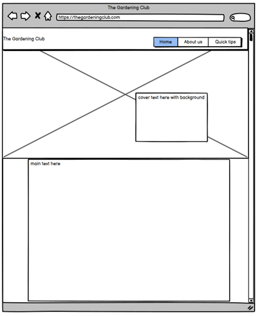

# THE GARDENING CLUB

The Gardening Club is a club website that can be used to encourage people to join and learn how to garden.

The live link can be found here - https://beebeebethc.github.io/The-Gardening-Club/

## Design and Accessibility
- For the design choices on The Gardening Club website, I wanted to keep my colour scheme throughout and keep it consistent. In order to achieve this I made sure that I had a high contrast and that everything was visible and easy to read and navigate.
- TODO insert colour pallete here
- the colours I chose because although they are green, they are of a high contrast to one another. I also wanted a pop of colour to appear on the nav bar for the selected page and on mouse hover. 

- TODO typography, why fonts selected and used accessibility (sans/sans-serif)
- TODO imagery *see screenshots* different aspects of the website design that are relevant features. 
- TODO wireframes across different devices/different perspectives. Mobile, Tablet, Laptop and Desktop. *bring images across from canva.*

- - -

## Contents

* [Design and Accessibility](#design-and-accessibility)
* [Contents](#contents)
* [Features](#features)
* [Technologies Used](#technologies-used)
* [Testing](#testing)
    * [Manual Testing](#testing)
* [Bugs](#bugs)
    * [Bugs Unfixed](#unfixed-bugs)
    * [Bugs Fixed](#fixed-bugs)
* [Deployment](#deployment)
* [Credits](#credits)
    * [Content](#credits)
    * [Media](#credits)

- - -

## Screenshots

TODO *move these to relevant places throughout*

## TODO Features

**general features, favicon, headings, navigation on each page this is what they are and what they contain**
**future implementations, things you want to do but haven't had time or skills to implement.**
**accessibility! screen readers, colour blindness. font choices. aria labels. alt text on images.**

## Technologies used:

languages, HTML, CSS. 

**frameworks, libraries and programmes used. Balsamiq wireframes Google Fonts, amiresponsive, Favicon, TinyPNG, Chrome dev tools. Github to store files, Gitpod to edit code.**

## Testing (turn into a table?)

I manually tested the Website on the Search Engines, Chrome, Firefox, Microsoft Edge. 

I also confirmed that the project is responsive and has a good consistent aesthetic across many standard screen sizes using the Chrome Devtools Device Toolbar. 

I tested and confirmed the navigation bar works and is easy to read including the return to home page throguh the use of The Gardening Club logo at the top of the page so that users can always return home. 

All links open in new windows to avoid losing the webpage when navigating to various external links. 

I confirmed that the form works and ensured the placeholder text disappears when typing. 
    
I also confirmed that the form needed to be completed fully in order to be able to submit information through the use of the form validation. 
    
The submit button also works when all fields are filled out properly.

wave testing TODO **get screenshot**

## Validator Testing
 - the form aspect on this website will not validate unless theres a valid full name and email address written in the form.
 
 
 

**CSS**

- CSS passed validating testing using jigsaw Ws3 validators no errors. 

**HTML pages**

HTML pages threw up a few errors on initial testing, these were:
 - Stray end tag in index.html (see screenshot) I'd applied an extra 'div' closing tag. On removal index.html validated no errors.
 - In the HTML document, 'about-us.html' I'd made a human error in my code in relation to aria tags and alt tags. I'd also missed a closing 'div' tag. On removing the aria and alt tags and adding the closing div element, the HTML document passed with no errors or warnings.
 - In quick-tips.html I had a stray end tag in a line of code within my footer element of the website. I'd also put in trailing slash characters which were absolute so I removed those and on removal, the code validated.

**Lighthouse scoring**

The lighthouse scores for Portfolio Project One, are below. The main focus for this project was every aspect of accessibility. 

## Bugs

**Unfixed bugs**
- Hover button should change colour on the menu on devices over 762px on mouse hover the navigation buttons should change colour to highlight which page you wish to visit. 

**Fixed bugs**
- sticky header achieved, the navigation bar and logo are present at all times. 
- by clicking the logo you can return to home page.
- Footer remains at the bottom of the website at all times. Prior to fixing this the footer would float above the bottom of the page.
- fixed bugs following validator testing and all pages are validated. 

## Deployment

- The Gardening Club was deployed to Github pages. 
- The steps I took to do this are as follows below: 
    - In the GitHub repository, I clicked on the "Settings" tab.
    - I then navigated to the "Pages" tab on the left-hand sidebar.
    - Under "Source" click the "None" dropdown and selected the "main" or "master" branch.
    - Clicked "Save".

- Once the master branch had been selected and the browser has reloaded itself, the page then provided the link to the live deployed version of the website.
    - The live link can be found here - https://beebeebethc.github.io/The-Gardening-Club/

local development - Fork/Clone TODO **look into these as well as something else!**

## Credits

**Content**

- The social media code and Media Queries from the love running project was used as a guide to create my own social media links and media queries on The Gardening Club website.

- TinyPNG used to optimise images for web browser purposes and to help support performance status of the website.

-cloudconvert to convert images to WEBP instead of JPG images.

- Chrome Devtools used to help identify visual bugs on a live preview.

- Flexbox support gained from:
    - Flexbox Froggy - https://flexboxfroggy.com
    - Flexbox Adventure https://codingfantasy.com/games/flexboxadventure/play 
    - Youtuber Bro Code - Channel https://www.youtube.com/@BroCodez to gain a better understanding of Flexbox, how it's used and how to incorporate it into my website.

- - -

**Media**

- About us image of Lavender, taken from Pexels.
- Index image and Hero image are authors own.
- Web Link to Gardeners world website for more gardening tips. 

- - -

**Acknowledgements**
 - My family and friends who continually support me.
 - Luke Buchanan, my mentor for his support through Project 1.
 - Kera Cudmore who helped me navigate the starts of my Readme documentation.