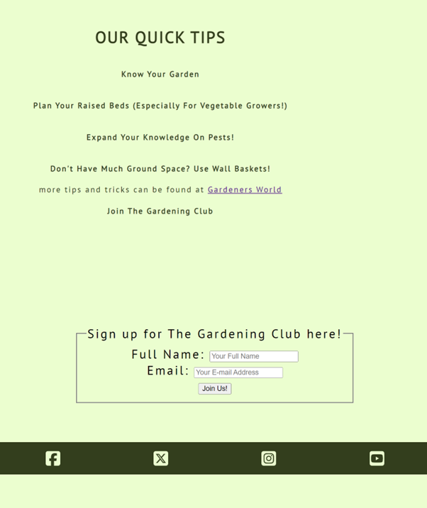

# THE GARDENING CLUB

The Gardening Club is a club website that can be used to encourage people to join and learn how to garden.

The live link can be found here - https://beebeebethc.github.io/The-Gardening-Club/

- - -

## Contents

* [Contents](#contents)
* [Design and Accessibility](#design-and-accessibility)
* [Features](#features)
* [Technologies Used](#technologies-used)
* [Testing](#testing)
    * [Manual Testing](#testing)
* [Bugs](#bugs)
    * [Bugs Unfixed](#unfixed-bugs)
    * [Bugs Fixed](#fixed-bugs)
* [Deployment](#deployment)
* [Credits](#credits)
    * [Content](#credits)
    * [Media](#credits)

- - -

## Design and Accessibility
- For the design choices on The Gardening Club website, I wanted to keep my colour scheme throughout and keep it consistent. In order to achieve this I made sure that I had a high contrast and that everything was visible and easy to read and navigate.

**Colour choices for this website**

- The colours I chose for The Gardening Club website are as follows:
    - The two contrasting shades of green represent just a couple of the different variations of green that can be found in gardens and hedgerows. 
    
    - As well as the greens used, I wanted to add a pop of colour to appear on the nav bar when a page was selected so that users could easily identify which page they are currently on.

    

**Typography**
- For The Gardening Club website, I used two different but complimentary fonts. These are google fonts:
    - 'Spectral MC', which is a Sans-serif font.
    - 'PT Sans' which is a Sans font.

    

## Screenshots

TODO *move these to relevant places throughout*

## Features
- For this website, I wanted the structure of the webpage to roughly stay the same throughout with only minimal changes to design and layout.

**

**general features, favicon, headings, navigation on each page this is what they are and what they contain**

**accessibility! screen readers, colour blindness. font choices. aria labels. alt text on images.**
- My reasoning for choosing these fonts are because:
- Both fonts are classed as web friendly fonts with their default fonts resorting to Sans-Serif and Sans should the browsers be unable to identify them both.
- The differences between them both aren't much however the Sans Serif font has a little added flare on the ends of the letters, perfect to use for something to stand out such as a logo but not be semi un-readable. 
- The Sans font on the other hand, is very clean and I personally thought it looked fresh and easy to read when incorporated into the mian content of my design.
- I also took these into account when designing the website because I wanted it to be as accessible as it possibly can be with users that are colour blind. In order to balance these two colours; knowingly choosing green, which is a colour that people with colour blindness struggle to distinguish between. Basing my website on green I knew I had to choose two colours that have a high contrast when compared to one another. 

**future implementations, things you want to do but haven't had time or skills to implement.**
## Languages, Technologies, Frameworks and Libraries:

**Languages**

- HTML5 - HTML version 5 was used to create the core of the website.

- CSS - CSS was used to style the website, implement fonts and to organise the layout.

- Python 3 only used via the Visual Studio Code terminal to preview my site on a local http server.

**Technologies, Frameworks and Libraries used** 

- Gitpod - The IDE used for editing and pushing my website changes to Github.

- Github - Github is used for storage of my website and to publish it online.

- Favicon generator - used to generate a png logo that is situated in the tabs bar for my website. 

- Google maps - Embed gained from Google maps inc.

- Balsamiq wireframes used to generate an outline of what the website should look like. 

- Google Fonts - used to confirm which fonts to be used. 

- Google Chrome - Used for Testing the Website.

- Am I responsive? - used to generate the image at the top of the document showing four different devices all at once. 

- TinyPNG website - used to compress images in order to load the website faster.

**Other Programmes used**

- Github - Github is used to store The Gardening Club website alongside Gitpages to publish it online.
- Canva - used for photo resizing. 

## Full Website Testing 

| Website Feature   | Expected Outcome | Testing Performed | Result | Pass or Fail |
| ----- | ----- | ----- | ----- | ----- |
| `Site Navigation` |                  
|  |  |  |  |  |
| The Gardening Club Logo and Title | When clicked the user will return to home page | Clicked logo and title | Redirected to home page | Pass | 
| Home Page Link | When clicked the user will return to home page | Clicked home link | Redirected to home page | Pass |
| About Us Link | When clicked to about-us page | Clicked the about us link | Redirected to about-us page | Pass | 
| Quick Tips Link | When clicked the user will get redirected to quick tips page | Clicked the quick-tips link | Redirected to quick-tips page | Pass |
| `Footer` |
|  |  |  |  |  |
| Social Media Links | When clicked the user will get redirected to the social media sites that open in new tabs| Clicked the social media links | social media links open in a new tab | Pass |
| `About-Us` |
|  |  |  |  |  |  
| Google Map Embed | Map should be responsive when interacted with | Clicked the map | Map zoomed in and out and responded as expected | Pass |
| `Quick-tips` | 
|  |  |  |  |  |  
| Gardener's World Link | When clicked, user will be redirected to a new tab on the Gardener's World Website | Clicked the link | Link opened in a new tab | Pass |
| Sign Up Form | Forms should not validate if left blank | Forms left blank | Form validator flagged up asking for input | Pass | 
| Sign Up Form | Form should not validate if partially filled in | entered full name but no email address | Form validator flagged up asking for email address| Pass | 
| Sign Up Form | Form should ask for a valid email address if no official email address is put in | Plain text put in | Form validator responded by asking for an official email address complete with '@' sign | Pass |
| Sign Up Form | placeholder text must disappear when typing | typed in the form boxes | placeholder text disappeared | Pass |

- - -

Full Testing was performed on a range of personal devices and those belonging to friends and family:

- Mobile devices
    - Samsung Galaxy A33
-  Laptop
    - Huawei Matebook

I also confirmed that the project is responsive and has a good consistent aesthetic across many standard screen sizes using the Chrome Devtools Device Toolbar.  

Testing was also performed on various Web Browsers: 

- Chrome 
- Firefox
- Microsoft Edge

- - -

## Further Testing 

## Wave Testing: 

## Validator Testing
 - the form aspect on this website will not validate unless theres a valid full name and email address written in the form.
 
 
 

**CSS**

- CSS passed validating testing using jigsaw Ws3 validators no errors. 

**HTML pages**

HTML pages threw up a few errors on initial testing, these were:
 - Stray end tag in index.html (see screenshot) I'd applied an extra 'div' closing tag. On removal index.html validated no errors.
 - In the HTML document, 'about-us.html' I'd made a human error in my code in relation to aria tags and alt tags. I'd also missed a closing 'div' tag. On removing the aria and alt tags and adding the closing div element, the HTML document passed with no errors or warnings.
 - In quick-tips.html I had a stray end tag in a line of code within my footer element of the website. I'd also put in trailing slash characters which were absolute so I removed those and on removal, the code validated.

**Lighthouse scoring**

The lighthouse scores for Portfolio Project One, are below. The main focus for this project was every aspect of accessibility.

Performance scores are lowered on two of the three pages due to high quality images used in the code. These images have been  compressed and converted.  

## Bugs

**Unfixed bugs**
- the footer of this page keeps 'floating' above the bottom of the page as seen in the screenshot below.

**Fixed bugs**
- sticky header achieved, the navigation bar and logo are present at all times. 
- by clicking the logo you can return to home page.
- Footer remains at the bottom of the website at all times. Prior to fixing this the footer would 'float' above the bottom of the page, as shown in the screenshot above.
- fixed bugs following validator testing and all pages are validated. 

## Deployment

- The Gardening Club was deployed to Github pages. 
- The steps I took to do this are as follows below: 
    - In the GitHub repository, I clicked on the "Settings" tab.
    - I then navigated to the "Pages" tab on the left-hand sidebar.
    - Under "Source" click the "None" dropdown and selected the "main" or "master" branch.
    - Clicked "Save".

- Once the master branch had been selected and the browser has reloaded itself, the page then provided the link to the live deployed version of the website.
    - The live link can be found here - https://beebeebethc.github.io/The-Gardening-Club/

- For local development, If you wish to explore behind the scenes of The Gardening Club, follow these steps below to create a clone:
    
    1. Go to the Repository that you wish to clone (https://github.com/BeeBeeBethC/The-Gardening-Club).
    
    2. Click on the green button with white text that reads 'code'.
    
    3. On the dropdown menu that appears once clicked, select the 'copy URL to clipboard' button (looks like two squares overlaying one another).
    
    4. Open your code editor, (for myself it's Visual Studio Code). On Visual Studio Code, Click the 'Source Control' button from the left hand side of the screen (the one that can also be used to commit changes).
        - 4a. On alternative code editors,open the terminal and change the working directory to the location of your cloned repository. 
    5. Paste the repository URL into the top navigation bar of Visual Studio Code.
        - 5a. On alternative code editors, type 'git clone' into the terminal and paste the link of the URL
    
    6. Save the Repository to a localised folder where the repository will be stored on your computer.
    
    7. Click on select Repository location. 
    
    8. Let the Repository download and click 'open' when the onscreen prompt appears in the bottom right hand corner of the screen.

- How to create a fork of The Gardening Club:

    1. Sign up or login to Github.
    
    2. Go to the repository for The Gardening club (https://github.com/BeeBeeBethC/The-Gardening-Club)
    
    3. Click the fork button on the top right hand side of the screen.

## Credits

**Content**

- The social media code and Media Queries from the love running project was used as a guide to create my own social media links and media queries on The Gardening Club website.

- TinyPNG used to optimise images for web browser purposes and to help support performance status of the website.

- Cloudconvert to convert images to WEBP instead of JPG images.

- Chrome Devtools used to help identify visual bugs on a live preview.

- Kera Cudmore's Webinar and supporting content of 'Creating your first README' was used as a guide to gain a better understanding of how to set up my own README documentation.  

- Flexbox support gained from:
    - Flexbox Froggy - https://flexboxfroggy.com
    - Flexbox Adventure https://codingfantasy.com/games/flexboxadventure/play 
    - Youtuber Bro Code - Channel https://www.youtube.com/@BroCodez to gain a better understanding of Flexbox, how it's used and how to incorporate it into my website.

- - -

**Media**

- About us image of Lavender, taken from Pexels.
- Index image and Hero image are authors own.
- Web Link to Gardeners world website for more gardening tips. 

- - -

**Acknowledgements**
 - My family and friends who continually support me.
 - Luke Buchanan, my mentor for his support.
 - Kera Cudmore who helped me navigate through the start of my README documentation.